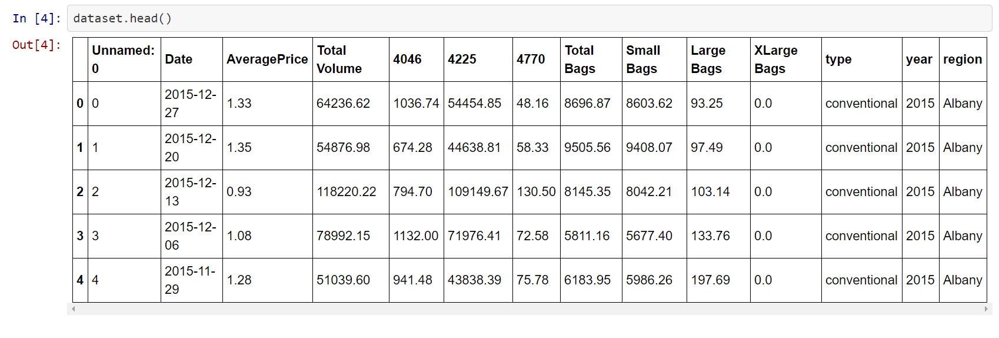
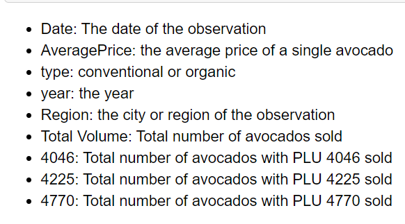
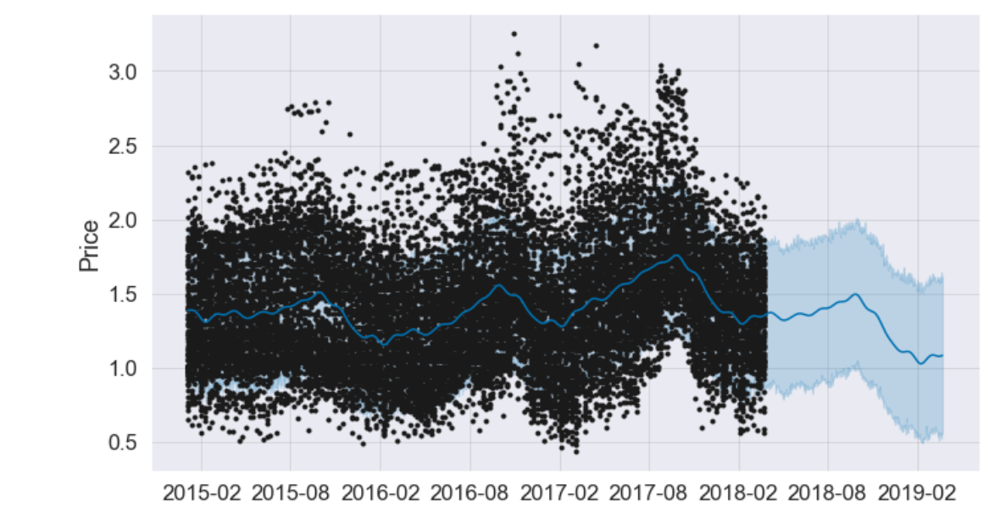
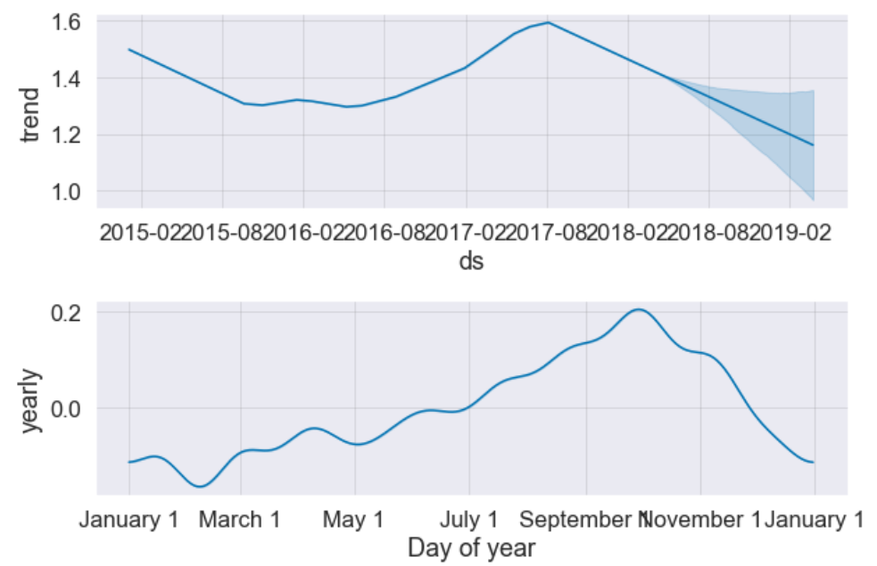

Facebook prophet is a python API used for forecasting time series data. 
It implements an additive regression model.
## Information about dataset

The dataset has the following input features:

Also, Total bags = Small Bags + Large Bags + XLarge Bags

It represents the price trends in different states of the USA, 
the price also depends on whether the type of avocado i.e. conventional/organic, the season etc.

## Results

The blue region is the future 1 year prediction and the black part represents the old training data.
We can clearly see from this graph that the prices are going to peak somewhere near end of 2018 and then it will drop.

We can see here that the price peaks around October.
